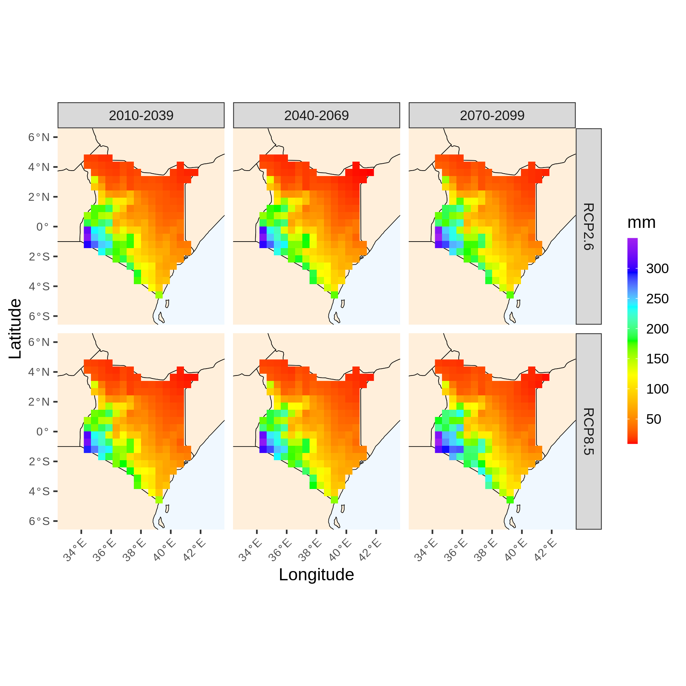
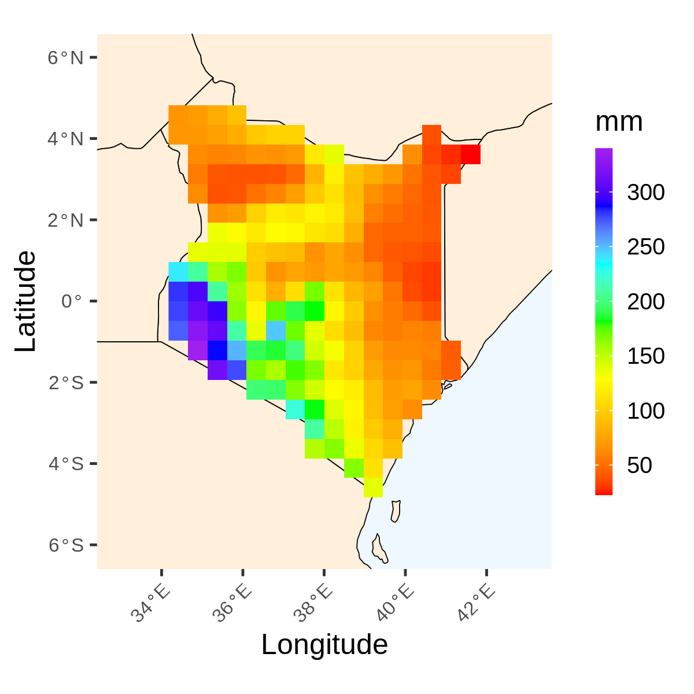

```{r setup, include=FALSE}
knitr::opts_chunk$set(echo = TRUE)
```

## Setting the scene

CHAT is made of 5 main functions. The first function automatically load the required information while the remaining 4 functions work with the output of function one. 
 The main feature of CHAT is the great flexibility and detailed analysis that can be performed semi-automatically with each function. 

1. **load_data**: used to load CORDEX-CORE models of a region of interest. The whole year is loaded as dafault as well as projections, RCPs, historical data and W5E5 dataset
2. **climate_change_signal**: used to visualize climate change signal and agreement in the sign of the climate change signal calculated as described by the IPCC. 
3. **proj**: used to visualize future projections. Bias-correction can be performed automatically as well as trend analysis.  
5. **trends**: used to calculate linear trends on spatially aggregated data. Bias-correction can be performed.
4. **hist**: used to visualize historical data (W5e5) [@cucchi_wfde5_2020]. Trend analysis can be performed

## Case study: Kenya
We provide an example of the figures that can be produced from the Hub and the figure captions to use when writing climate climate risk assessments. The below figures refer to season **Jan-March**.

## load_data function

The load_data function allows the user to load data for a particular country or region of interest. This step takes up to 15 minutes for big countries. 

`load_data(country, xlim, ylim, domain)`

## climate_change_signal function 

This function allows the user to look at model agreement in the sign of the climate change signal (as defined by the IPCC) as well as the mean of climate change signal (average deviation from historical period) and standard deviation of the climate change signal (between models standard deviation). When precipitation is selected (var="pr), values refer to annual total precipitation while when temperature variables are selected ("tasmax" or "tasmin"), mean annual temperature is calculated. When a threshold argument is specified, then climate change signal refers to number of days. For example, average number of days in which precipitation was lower than 1 mm compared to baseline in a 30 year time frame. It is also possible to look at maximum duration of dry spells (when lowert=1, consecutive = TRUE and duration="max") as well as total duration of dry spells longer than 6 days (when lowert=1, consecutive = TRUE and duration="total"). This function has several arguments. 

`climate_change_signal(data, save, plot_name, season, lowert=NULL, uppert=NULL, int_month=NULL, palette=NULL, prov.country=NULL)`

1. **save**: logical. Used to save or not the plots
2. **plot_name**: Character.Specify the name of the plot
3. **season**: numerical. Season of interest
4. **lowert**: numerical. Lower threshold
5. **uppert**: numerical. Upper threshold
6. **int_month**: Numerical. Automatic plotting by season. Can either take 6 or 3
7. **palette**: character. User specified color palette
8. **prov.country**: character. Specify the country name for which to see provinces
9. **consecutive**: logical. Whether consecutive days should be applied to the specified threshold. To use in combination with argument duration.
10. **duration**: character. Can be either "max" or "total". When "max" is specified, this refers to maximum duration of consecutive days with a certain threshold. For example, if lowert is set as 1, this would refer to maximum duration of dry spells. 

#### Thresholds are not specified

The example below is when threshold are not defined. In this case:

`climate_change_signal(data_out, save=TRUE, plot_name="Kenya", season=1:3)`

![Fig.1. Mean and standard deviation of the climate change signal for precipitation in Kenya, January-March. The first plot indicates the overall difference in total annual precipitation (average of 6 CORDEX-CORE models) from historical period (1976-2005). The black dot indicates whether at least 60% of the models agree in the sign of the climate change signal (positive or negative). The second plot shows the average annual standard deviation in the climate change signal calculated from the 6 CORDEX-CORE models. Figure produced with the Climate HAzard toolbox (CHAT) developed at FAO (Climate risk team)](figures/Kenya.png)

#### Thresholds are specified
We now look at the climate change signal in the number of dry days (precipitation < 1 mm)


`climate_change_signal(data_out, save=TRUE, plot_name="Kenya", lowert=1, season=1:3, consecutive=FALSE, duration="max")`

![Fig.2. Mean and standard deviation of the climate change signal for annual dry days in Kenya (days with less than 1 mm of rain), January-March. The first plot indicates the annual average difference in dry days (average of 6 CORDEX-CORE models) from historical period (1976-2005). The black dot indicates whether at least 60% of the models agree in the sign of the climate change signal (positive or negative). The second plot show the average annual standard deviation in the climate change signal for dry days from 6 CORDEX-CORE models. Figure produced with the Climate HAzard toolbox (CHAT) developed at FAO (Climate Risks Team) ](figures/Kenya_lowert.png)


#### Thresholds are specified as well as consecutive
We now look at the climate change signal in the maximum duration of dry spells (pr<1). 

`climate_change_signal(data_out, save=TRUE, plot_name="Kenya", lowert=1, season=1:3, consecutive=TRUE, duration="max")`

![Fig.3. Mean and standard deviation of the climate change signal for maximum duration of dry spells in Kenya (maximum number of consecutive dry days), January-March. The first plot indicates the annual average difference in maximum duration of dry spells (average of 6 CORDEX-CORE models) from historical period (1976-2005). The black dot indicates whether at least 60% of the models agree in the sign of the climate change signal (positive or negative). The second plot show the average annual standard deviation in the climate change signal for maximum duration of dry spells from 6 CORDEX-CORE models. Figure produced with the Climate HAzard toolbox (CHAT) developed at FAO (Climate Risks Team) ](figures/Kenya_ccs_max 1-2-3.png)


## proj function

This function is used to look at climate projections. It includes the option to bias-correct the data. By default, the scaling method is used but the user can specify alternative methods. When thresholds are not specified, results are cumulative (in case of precipitation) or averages (in case of temperatures). The option trends allows the user to see the results of linear regression applied to yearly value for each pixel, time-frame and RCP. Linear regression is applied in a 30 years by 30 years time frame. When both thresholds and trends are specified, linear regression is applied to the total number of days per season in which a certain threshold was or was not exceeded. The results for each model are averaged before visualization, thus an ensemble mean is computed after applying for each model the specified operations and bias-correction. For example, if bias.correction is set to TRUE and uppert is specified, first bias correction is applied to each model, then the number of days exceeding uppert are calculated and lastly the ensemble mean is performed.

`proj(data, save, plot_name, season, lowert=NULL, uppert=NULL, int_month=NULL, trends, palette=NULL, bias.correction, prov.country=NULL, consecutive=FALSE, duration="max")`

1. **save**: logical. Used to save or not the plots
2. **plot_name**: character. Specify the name of the plot
3. **season**: numerical. Season of interest
4. **lowert**: numerical. Lower threshold
5. **uppert**: numerical. Upper threshold
6. **int_month**: numerical. Automaic plotting by season. Can either take 6 or 3
7. **trends**: logical. Apply linear regression or not
8. **bias.correction**: logical
9. **palette**: character. User specified color palette
10. **method**: character. Method to apply for bias-correction. Scaling is default option but can be one of **eqm**, **dqm**, **pqm**, **qdm**, **scaling**.
11. **prov.country**: character. Specify the country name for which to see provinces
12. **consecutive**: logical. Whether consecutive days should be applied to the specified threshold. To use in combination with argument duration.
13. **duration**: character. Can be either "max" or "total". When "max" is specified, this refers to maximum duration of consecutive days with a certain threshold. For example, if lowert is set as 1, this would refer to maximum duration of dry spells. 


#### Thresholds are not specified and trends is set as FALSE
`proj(data_out, save=TRUE, plot_name="Kenya_proj", trends=FALSE, seaosn=1:3, consecutive=FALSE, duration="max")`




We now perform bias correction

`proj(data_out, save=TRUE, plot_name="Kenya_proj", trends=FALSE, bias.correction=TRUE,  consecutive=FALSE, duration="max")`


#### Trends is set as TRUE but thresholds are not specified

In this case we would be looking at the yearly increase in precipitation and whether that increase is significant or not. 

`proj(data_out, save=TRUE, plot_name="Kenya_proj", trends=TRUE, bias.correction=FALSE,  consecutive=FALSE, duration="max")`


#### Trends is set as TRUE and thresholds are specified

`proj(data_out, save=TRUE, plot_name="Kenya_proj", trends=TRUE, bias.correction=FALSE, lowert=1,  consecutive=FALSE, duration="max")`

In this case we would be looking at the yearly increase in number of days in which there was less than 1 mm of rain. 

![Fig.7. Yearly increase in total number of dry days in Kenya, January-March. Linear regression is applied to each pixel using the total number of days per year (specified season) with less than 1 mm of rain. Thus, values refer to yearly increase in number of dray days and wheter the increase is statistical significant (black dot) or not (absence of black dot). The multi-model ensemble mean (average of 6 CORDEX-CORE models) is used. Figure produced with the Climate HAzard toolbox (CHAT) developed at FAO (Climate Risk Team).   ](figures/Kenya_trends_dry.png)

## hist function

The historical function visualizes data from the W5e5 dataset [@cucchi_wfde5_2020], which is an observational dataset giving highly accurate past climatic data information. Similar to the proj function the hist function allows the user to look at trends. 

`proj(data, save, plot_name, season, lowert=NULL, uppert=NULL, int_month=NULL, trends, palette=NULL, prov.country=NULL,  consecutive=FALSE, duration="max")`

1. **save**: logical. Used to save or not the plots
2. **plot_name**: character. Specify the name of the plot
3. **season**: numerical. Season of interest
4. **lowert**: numerical. Lower threshold
5. **uppert**: numerical. Upper threshold
6. **int_month**: numerical. Automaic plotting by season. Can either take 6 or 3
7. **trends**: logical. Apply linear regression or not
8. **palette**: character. User specified color palette
9. **prov.country**: character. Specify the country name for which to see provinces
10. **consecutive**: logical. Whether consecutive days should be applied to the specified threshold. To use in combination with argument duration.
11. **duration**: character. Can be either "max" or "total". When "max" is specified, this refers to maximum duration of consecutive days with a certain threshold. For example, if lowert is set as 1, this would refer to maximum duration of dry spells. 


#### Thresholds is not specified and trends is set as FALSE

`hist(data_out, save=TRUE, trends=FALSE, season=1:3,  consecutive=FALSE, duration="max")`



#### Trends is set as TRUE but thresholds are not specified

`hist(data_out, save=TRUE, trends=TRUE, season=1:3,  consecutive=FALSE, duration="max")`


#### Trends is set as TRUE and threshold are specified

`hist(data_out, save=TRUE, trends=TRUE, lowert=1, season=1:3,  consecutive=FALSE, duration="max")`

![Fig.10. Yearly increase in total number of dry days in Kenya, January-March (1980-2005) using the w5e5 reanalysis dataset. Linear regression is applied to each pixel using the total number of days per year (specified season) with less than 1 mm of rain. Thus, values refer to yearly increase in number of dray days and wheter the increase is statistical significant (black dot) or not (absence of black dot). Figure produced with the Climate HAzard toolbox (CHAT) developed at FAO (Climate Risk Team).   ](figures/hist_trends_dry.png)


## Trends function

The trend function visualizes spatially aggregated data and linear regression is applied to yearly value. The difference with the trends argument in the proj function is that linear regression was applied to a 30 year time frame while the trend functions applies linear regression to the whole time period (90 years) and it also allows the visualization of observed data (1980-2005).  


`trends(data, save, plot_name, season, lowert=NULL, uppert=NULL, int_month=NULL, y.range=NULL, bias.correction,  consecutive=FALSE, duration="max")`

1. **save**: logical. Used to save or not the plots
2. **plot_name**: character. Specify the name of the plot
3. **season**: numerical. Season of interest
4. **lowert**: numerical. Lower threshold
5. **uppert**: numerical. Upper threshold
6. **int_month**: numerical. Automaic plotting by season. Can either take 6 or 3
7. **bias.correction**: logical. Apply linear regression or not
8. **y.range**: atomic vector. Constrain y axis
9. **method**: character. Method to apply for bias-correction. Scaling is default option but can be one of **eqm**, **dqm**, **pqm**, **qdm**, **scaling**.
10. **consecutive**: logical. Whether consecutive days should be applied to the specified threshold. To use in combination with argument duration.
11. **duration**: character. Can be either "max" or "total". When "max" is specified, this refers to maximum duration of consecutive days with a certain threshold. For example, if lowert is set as 1, this would refer to maximum duration of dry spells. 

#### Bias.correction is set as FALSE

`trends(data, save=TRUE, bias.correction=FALSE, season=1:3,  consecutive=FALSE, duration="max")`


#### Bias.correction is set as TRUE

`trends(data, save=TRUE, bias.correction=TRUE, season=1:3,  consecutive=FALSE, duration="max")`


#### Bias.correction is set as TRUE and uppert is specified

`trends(data, save=TRUE, bias.correction=TRUE, season=1:3, uppert=20,  consecutive=FALSE, duration="max")`

